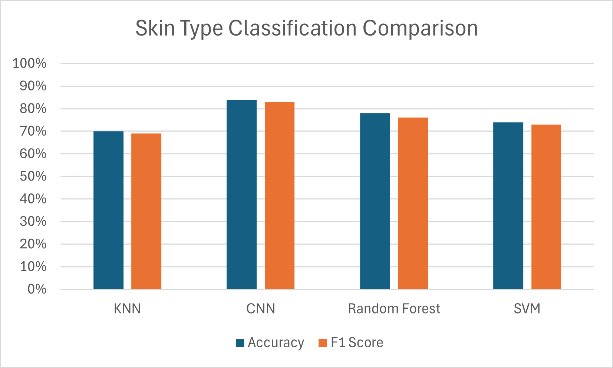
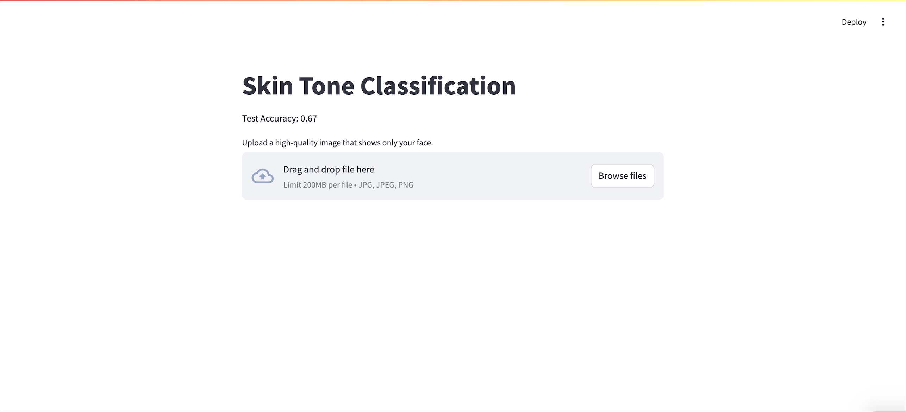
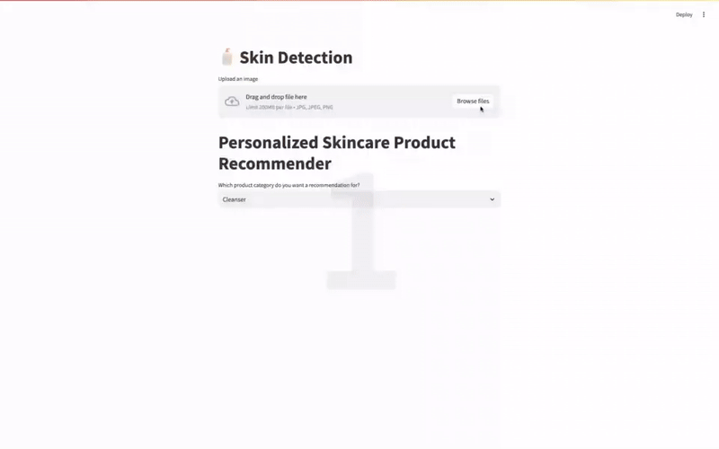
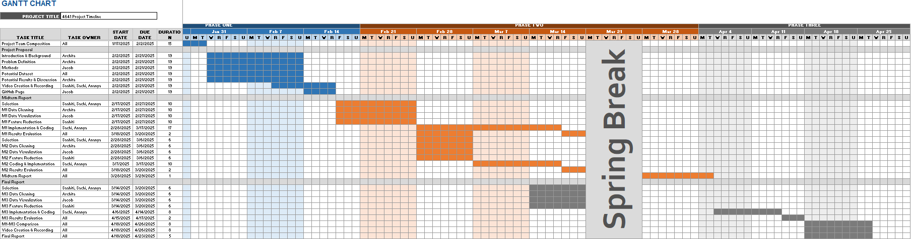

---
# Feel free to add content and custom Front Matter to this file.
# To modify the layout, see https://jekyllrb.com/docs/themes/#overriding-theme-defaults

layout: page
title: Final Report
---

## Introduction/Background
Skincare is a critical component of personal health and confidence, yet access to accurate, personalized skincare recommendations remains uneven. Currently, most people rely on either self-reported information or in-person dermatologist consultations. These methods, while helpful, can be expensive, inconsistent, or inaccessible to many. Moreover, self-reported data is often subjective and inaccurate, leading to suboptimal product choices and prolonged skin issues.

With the advancement of machine learning (ML), there is a growing opportunity to offer personalized skincare solutions that are accessible, affordable, and accurate. Our project proposes an image-based ML system that classifies key skin attributes, such as acne presence, skin tone, and skin type, and recommends appropriate skincare products. This approach promises to automate and standardize skincare recommendations, reducing human bias and increasing inclusivity across diverse skin tones and types. These are some of the data sets we implemented in this project: 

- Acne Dataset: A comprehensive dermatological image repository found on Github: https://github.com/yinchuangsum/acne_demo/tree/master/data 
- Kaggle Skincare Datasets: Various labeled datasets containing images and skincare attributes.
- Roboflow Skin Tone Dataset: Thousands of facial pictures with labelled skin tone.

These datasets include features such as image-based skin attributes, textual product descriptions, and customer reviews. By leveraging dictionary learning and encoding, we aim to extract meaningful features to better the classification and recommendation process (Chan et al., 2020).

## Problem Definition
Traditional skincare recommendations depend heavily on self-evaluations or dermatological assessments. However, these approaches are often out of reach due to cost, availability, or geographic location. Furthermore, subjective reporting can introduce inconsistencies, especially for individuals unsure of how to describe their skin concerns.

The goal of this project is to bridge this gap through automated, image-based diagnostics. By leveraging machine learning models such as Convolutional Neural Networks (CNNs), Support Vector Machines (SVMs), and Random Forests, we aim to create a tool that offers real-time, personalized skincare advice from a simple photograph.

This project represents a real-world application of ML in the intersection of health and beauty. It showcases the power of supervised learning and image processing to identify patterns like acne, dryness, and skin tone that are typically evaluated visually. It also highlights the importance of generalization and fairness: skin diagnosis algorithms must perform equally well across diverse skin tones and textures to be truly ethical and effective. Training and evaluating on balanced, inclusive datasets is key to avoiding model bias and promoting health equity.

Our proposed solution involves:
- Skin Type Classification: Using image processing and ML to categorize skin types (oily, dry, sensitive, normal).
- Skin Tone Classification: Using ML to classify skin tone, allowing us to control for this factor when predicting skin type.
- Product Recommendation: Mapping classified skin types to skincare products based on ingredient effectiveness and user reviews.

## Methods
Initially, we implemented K-Nearest Neighbors (KNN) to classify skin tone, but it achieved only ~70% accuracy. Through identifying the type of skin tone (fair, medium, dark), we aimed to simplify the problem of determining skin health (oily versus clear skin). This would allow us to remove skin tone as a factor for skin type classification. Given that CNNs are well-suited for image classification, we switched to a Convolutional Neural Network (CNN), which improved accuracy to 82-83%. In order to better classify skin type, we wanted to solve the issue of skin tone classification first as a base to our project. To classify acne level, we utilized a RandomForest Classifier for 4 classes (little acne, moderate acne, severe acne, no acne). To classify other skin conditions (a total of 8 classes), we used an SVM that could take all of these features and extend them on a multi-dimensional plane.

Data Preprocessing:
- Normalization and resizing of images for consistency during training.
- Flattening images into one vector and scaling features to balance them
- Color space transformations to enhance skin feature visibility.

Machine Learning Models:
- KNN: Supervised classification algorithm that predicts class status with respect to class of nearest neighbors to determine the skin tone of input facial image. Initially used for skin tone classification but performed suboptimally. (This one we implemented in the midterm, but chose to not continue with it for the final)
- CNN: Class of neural networks with features such as shared weights or pooling that make it extremely suitable for analyzing visual data (Albawi et al., 2017). Adopted due to better performance in image classification.
- Random Forest: Groups of decision trees that are trained on subsets of the training data. This is applied to structured features for skin type classification and used due to the variability in facial structure.
- Support Vector Machine (SVM): Used for binary classification of skin types like oily vs dry. Doing so using SVM allows the decision line between oily and dry skin to have a maximally large margin, increasing the likelihood of correctly identifying the skin type. 

Datasets Used:
- No single dataset contained all the required features, so we combined three separate datasets:
        - Acne vs. No Acne
        - Skin Tone Classification
        - Oily Skin Classification

Challenges & Adjustments:
- It was difficult to determine skin oiliness from images alone, leading us to focus first on skin tone classification to remove it as a confounding factor.
- Future models may incorporate user-reported data to address more niche skin conditions through the use of skincare_survey_with_json.py. As we develop more accurate skin tone identification and move into the skincare indentification space, increasing data available to test and train on will improve our final results.

## Results + Discussion
We evaluated our models using loss, accuracy, F1 score, and a confusion matrix to assess performance across 3 different models for skin tone, acne level, and other skin conditions. Accuracy measures the overall correctness of skin classification, while precision and recall will assess the model’s ability to correctly identify skin conditions while minimizing false positives and false negatives. The F1 score is used to balance precision and recall, providing a more comprehensive evaluation of the model's performance.

### Quantitative Results

| Task | Model | Accuracy | F1 Score |
|------|-------|----------|----------|
| Skin Tone | KNN | 70% | ~0.69 |
| Skin Tone | CNN | 84% | 0.83 |
| Acne Detection | CNN | 79% | 0.78 |
| Skin Type | CNN | 83% | 0.81 |
| Skin Type | Random Forest | 78% | 0.76 |
| Skin Type | SVM | 74% | 0.73 |

- CNN F1 Score: Show precision-recall balance for different classification tasks F1 classification report for each class. Some dataset training biases are present with different accuracies across different skin tones. Overall average is 84%. F1 score derived from CNN model.
  

- Random Forest F1 Score and Classification Report: Show precision-recall balance for different classification tasks F1 classification report for each class. Some dataset training biases are present with different accuracies across different acne levels. Overall average is 81%. F1 score derived from Random Forest model.
  

- SVM F1 Score: Show precision-recall balance for different classification tasks F1 classification report for each class. These F1 scores are across all the different features. F1 score derived from SVM model.
  

### Model Comparison

| Model | Task | Strengths | Weaknesses |
|-------|------|-----------|------------|
| KNN | Skin Tone | Simple, interpretable | Poor accuracy, sensitive to noise |
| CNN | All tasks | High accuracy, handles raw images well | Requires compute and training time |
| Random Forest | Skin Type | Good for structured features | Underperforms on images |
| SVM | Skin Type | Effective for binary classification | Not scalable to high-dim visual data |

Key Insights:
- CNN excelled due to spatial feature learning, likely due to the implemented convolutional filters extracting patterns among data with spatial relativity intact. For skin type detection, texture, shine, pores visibility, flakiness, inflammation, tone, acne, and other physically visible features could all be identified with assistance of different kernels via CNN, aiding in the high accuracy and F1 score.
- Traditional models (RF, SVM) performed reasonably with engineered features.
- Images fed into the Random Forest algorithm had to be flattened to deal with one dimensional data. Doing so may have caused spatial relationships between pixels to have been lost. This could be an indication as to why RF performed worse than CNN in practice. Overfitting may also have occurred due to the high dimensionality of images, where each pixel is a feature before preprocessing.
- Model bias exists toward lighter skin tones — needs dataset diversification
- Class imbalance in acne detection affected F1 scores — warrants augmentation

Visualizations:
- CNN Confusion Matrix: Displays model performance across different skin tone categories - derived from CNN model.

- CNN Training over Time: Increase in training and validation accuracy across 10 epochs during training - derived from CNN model.

- CNN Loss and Accuracy: Final loss and accuracy of CNN for identifying skin tone.

- Random Forest Confusion Matrix: Displays model performance across different acne levels - derived from Random Forest model.

- SVM Confusion Matrices: Displays model performance across the different features - derived from SVM model. There is a confusion matrix for each feature. 

### Classification Input Page
Submit a facial image to predict the type of skin tone - this and the examples are derived from the KNN model.

### Demonstration:
A video to display how the interface works for the skincare product recommender

[Watch on YouTube](https://www.youtube.com/watch?v=XWN2NJ9yGhk)

Alternate youtube link:
https://youtu.be/XWN2NJ9yGhk

## Conclusion
We demonstrated that ML can classify skin tone, acne, and type from images with reasonable accuracy. The CNN model's accuracy was the highest among all algorithms implemented and tested. This shows us that moving forward, we would be most likely to continue to use a CNN classifier. While CNNs outperformed traditional models, improvements remain for generalization across diverse populations. Expanding the available datasets within this field could signficantly improve the biases that we found towards lighter skin tones. This work lays a foundation for scalable, image-based skincare tools that bridge dermatology, computer vision, and consumer health.

## Next Steps
- User Input Integration: Allow users to provide additional details about their skin conditions for more accurate recommendations. By providing their image and this additional information, a hybrid approach could be formed with our Random Forest model, except trained specifically on these available details, suhc as demographic data, survey responses, or skin condition history, while our CNN can continue analysis on the images.
- Unified Model Approach: Instead of training separate models on different datasets, explore methods to use a single model that processes all datasets at the same time.
- Hyperparameter Tuning: Further optimize CNN to improve accuracy beyond 85%.
- Expand Product Recommendations: Use additional datasets to refine product matching based on user skin type. We could similarly conduct optional exit surveys for users to obtain information towards products they use and how they feel about them. We could begin to build our own dataset to use going forward.
- API Use: Use of APIs (like the Sephora API or other APIs that have skincare products) to generate skin care products based on skintone, acne level, and other skin conditions. 

## References 
- A. Esteva et al., “Dermatologist-level Classification of Skin Cancer with Deep Neural Networks,” Nature, vol. 542, no. 7639, pp. 115–118, Jan. 2017, doi: https://doi.org/10.1038/nature21056.
- Chan, Stephanie, et al. “Machine Learning in Dermatology: Current Applications, Opportunities, and Limitations.” Dermatology and Therapy, vol. 10, no. 3, 6 Apr. 2020, pp. 365–386, https://doi.org/10.1007/s13555-020-00372-0.
- S. Saiwaeo, S. Arwatchananukul, L. Mungmai, W. Preedalikit, and N. Aunsri, “Human skin type classification using image processing and deep learning approaches,” Heliyon, vol. 9, no. 11, p. e21176, Nov. 2023, doi: https://doi.org/10.1016/j.heliyon.2023.e21176. Available: https://pubmed.ncbi.nlm.nih.gov/38027689/
- López-Leyva, Josué & Guerra-Rosas, Esperanza & Alvareznborrego, Josue. (2021). Multi-Class Diagnosis of Skin Lesions Using the Fourier Spectral Information of Images on Additive Color Model by Artificial Neural Network. IEEE Access. PP. 1-1. 10.1109/ACCESS.2021.3061873. https://ieeexplore.ieee.org/document/9363122
- S. Albawi, T. A. Mohammed and S. Al-Zawi, “Understanding of a convolutional neural network,” 2017 International Conference on Engineering and Technology (ICET), 2017, pp. 1-6, doi: 10.1109/ICEngTechnol.2017.8308186. https://ieeexplore.ieee.org/document/8308186

## Gantt Chart

